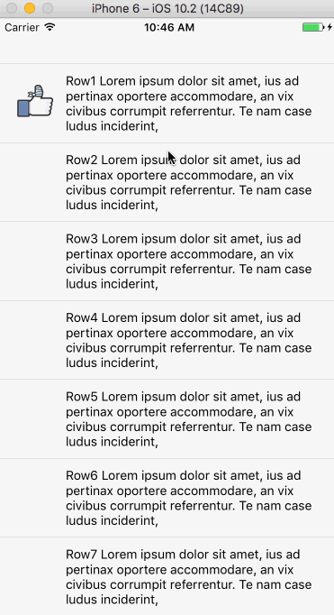

# react-native-expand


A expandable component for React Native



## Getting started
```bash
npm install react-native-expand --save
```

## Example usage

```javascript
class App extends React.Component {
  constructor(props) {
    super(props);
    this.ds = [BandageIcon,CallIcon,DislikeIcon,
    FistIcon, FlowersIcon, HeartIcon, LikeIcon,
    LikingIcon, PartyIcon, PokeIcon, SuperLikeIcon, VictoryIcon];
  }

  renderRowData(rowData, index) {
    return (
      <View key={index} style={styles.row}>
        <Image style={styles.thumb} source={rowData}/>
        <Text style={styles.text}>Row{index + 1} {LOREM_IPSUM}</Text>
      </View>
    );
  }

  render() {
    return (
      <ExpandablePanel
        contentPanelStyle={styles.container}
        dataSource={this.ds}
        renderRow={this.renderRowData}
      />
    )
  }
}
```

## Properties

| Prop | Description | Default |
|---|---|---|
|**`contentPanelStyle`**|The style for the component container.|None|
|**`footerPanelStyle`**|The style for the footer container.|None|
|**`footerTextStyle`**|The style for the footer text.|None|
|**`dataSource`**|The dataSource for the component to use.| None |
|**`renderRow`**|The function to defined how the item to be showed.|None|
|**`renderHeader`**|The function to render customer header for this component.|None|
|**`minRowCount`**|The minimum count of rows to render when the component is collapsed .|`1`|
|**`expandText `**|The text to indicate expand operation.|`↓ Load More`|
|**`collapseText `**|The text to indicate collapse operation.|`↑ Collapse`|